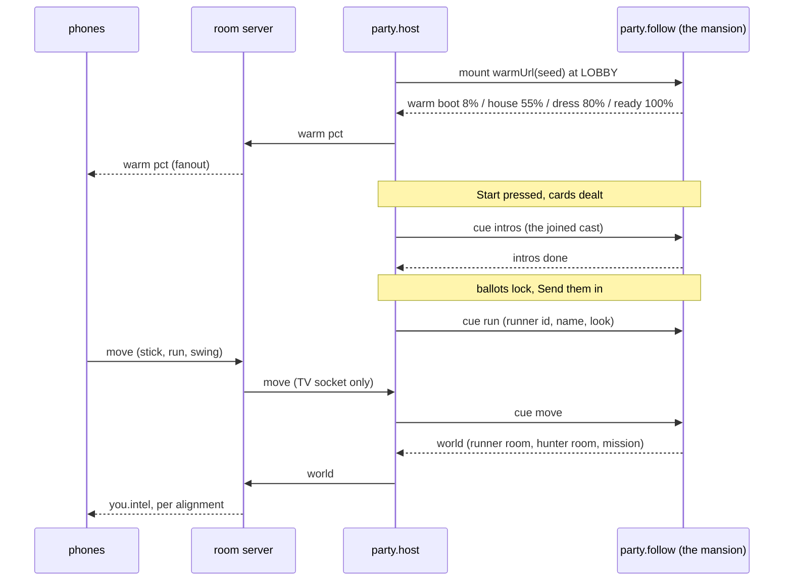

# task-prime-time-lobby-warm-night — the night warms in the lobby, and the runner is a body

Decided plan. The decisions below are made; the numbers are the numbers to use. If a stated fact
turns out to be wrong, **say so in the report rather than diverging silently** — this document has
been wrong before and the report is where that gets caught.

`docs/design/party-loop.md` still wins on any disagreement about the party game.

---

## 0. Why this slice exists

John playtested D13 on `bb7cf6a` and reported one sentence that contains the whole brief:

> *the mansion only loaded AFTER nominations locked, took a long time, and had no loading
> indicator.*

All three halves of that are the same defect. `views/party-host.js` computes `followUrl()` inside
`paint()` and only returns a string once `beat === 'expedition'` **and** a runner exists — so the
iframe is created at the exact moment the room has finished the one social beat that was holding
their attention. Then it fetches a 9.0 MB character GLB, bakes a mansion's worth of procedural
materials, and compiles every shader, in front of eight people staring at a slate that says
"camera warming" with no idea whether it is broken.

Measured in `docs/party/show.js`'s own header: **22.6–23.7 s to first rendered frame** on a
software rasteriser. The `STUB_SHOW_PLAN` recap timer is 26 s. The show has been spending 87% of
its only produced beat loading.

The fix is not "make it faster". The fix is **move it earlier**: the lobby is dead air that already
exists, and the mansion should be baking through all of it.

Everything else in this slice follows from having a live, warm mansion sitting there before Start:
once the house is already up when the night begins, it can hold an intro sequence, it can be driven
by a phone instead of a script, and it can run a real mission.

---

## 1. File ownership

**You may edit exactly these files.** Anything else is another owner's and a collision is a
merge conflict at best and a silently reverted decision at worst.

| file | what changes | status |
|---|---|---|
| `docs/slices/task-prime-time-lobby-warm-night.md` | this file | new |
| `src/party/follow.js` | + the warm slot and the cue channel schema | edit |
| `src/party/mansion.js` | the seeded plan choice, pure | **new** |
| `src/party/guidemap.js` | the guide's phone map, pure SVG | **new** |
| `src/party/intel.js` | vague-vs-exact hunter/runner intel, pure | **new** |
| `src/party/look.js` | more shells and accents | edit |
| `src/party/night-skin.js` | warm layer, warm bar, slim swatches, map, stick | edit |
| `src/party/room.js` | `setWorld`, `you.intel`, mission log | edit |
| `src/views/party-host.js` | mount at lobby, indicator, cue relay | edit |
| `src/views/party-phone.js` | slim picker, stick, guide map, intel | edit |
| `src/views/party-follow.js` | warm mode, cue listener, progress | edit |
| `src/game/follow-bed.js` | tables, phone drive, sledge, avatar, mission | edit |
| `src/game/intro-bed.js` | the ballroom intro | **new** |
| `src/game/room.js` | `o.tables` — **one small override, nothing else** | edit |
| `net/party/entitle.js` | + the `you.intel` rows | edit |
| `net/party/local.mjs` | + `warm` fanout, `move` / `world` handling | edit |
| `harness/party-warm.mjs` | the new gate | **new** |
| `package.json` | `gates:party` gains `party-warm` | edit |

**Owned by other systems — do not edit:**

- `src/views/game.js` — the art/physics bed. It is a *consumer* of `src/game/room.js` and this
  slice must not regress it. Carry techniques out of it; do not import from it and do not edit it.
- `src/game/player.js`, `src/game/sledge.js`, `src/characters/mesh-avatar.js` — used as-is.
- `src/world/genplan.js`, `harness/genspike.mjs` — the generator. Read it, call it, do not change
  it. `genspike.mjs` has **zero imports** and that is load-bearing (see §6 trap 4).
- `net/party/server.js` — the PartyKit adapter. Out of scope this slice; it already lags
  `local.mjs` on `name`/`look`/`ballot`/`show`, and widening that gap is a known, accepted debt.

---

## 2. The shape of the change, in one paragraph

Today the TV mounts **one iframe per expedition**, built from a URL that encodes the runner. This
slice mounts **one iframe per night**, at lobby, from a URL that encodes only the world seed —
and then never touches `iframe.src` again. Everything that used to be re-encoded in a new URL
(who is running, what the pad is doing, when the intros play) arrives over a `postMessage` **cue
channel** with its own closed schema. One iframe means one WebGL context, one GLB fetch and one
bake for the whole night, and it means the bake happens while people are still typing their names.



Note the direction of the last two arrows. **The TV renders the world, so the TV is the only thing
that knows where anybody is** — the server has never simulated an expedition and does not start
now. The TV reports; the server *filters*. That keeps hidden-role filtering exactly where it
already lives (`net/party/entitle.js`) instead of inventing a second one.

---

## 3. The changes, numbered

### 3.1 The night slot — `src/party/follow.js`

`FOLLOW_BEATS` stays `['expedition']` and `followUrl()` keeps its exact current contract. **Do not
touch either.** `harness/party-follow.mjs` F0c asserts `FOLLOW_BEATS.length === 1`, and F1–F9 are
twenty-odd assertions on `followUrl` that are all still true and all still worth having: it remains
the way a developer opens one runner's camera by hand.

Add alongside it:

1. **`WARM_KEYS = ['view', 'room', 'seed', 'warm']`** and **`warmUrl({ room, worldSeed, origin })`**.
   Returns `?view=party.follow&warm=1&room=…&seed=…`. It carries **no runner, no name, no look**,
   because at lobby there is no runner and because a URL that changed when the cast changed would
   reload the mansion — which is the entire defect this slice exists to delete.

   Add `'warm'` to `FOLLOW_KEYS`. That is safe against F2c, which only walks the keys
   `followParams()` actually emits, and `followParams()` must **not** emit `warm`.

2. **`CUE_KINDS = ['intros', 'run', 'move', 'shot', 'idle']`** and
   **`cueViolations(cue)`** — the closed schema on the postMessage channel. It reuses
   `FOLLOW_FORBIDDEN` verbatim. This is the point of putting it in this file rather than a new one:
   there is now a second channel into the same renderer, and it must fail closed on the same
   words the URL fails closed on. A `cue` carrying `flyover`, `marks`, `lid`, `role`, `alignment`
   or `hunter` is a throw, not a drop.

   Per-kind allow-lists, and they are closed:

   | kind | keys |
   |---|---|
   | `intros` | `kind`, `cast[]` of `{ id, seat, name, shell, accent }` |
   | `run` | `kind`, `runner`, `name`, `shell`, `accent` |
   | `move` | `kind`, `x`, `y`, `run`, `swing`, `act` |
   | `shot` | `kind`, `shot` (a `SHOT_NAMES` value) |
   | `idle` | `kind` |

   `cast[]` is lobby cosmetics and published names — the exact fields `FANOUT_KEYS.lobbySeat`
   already fans out to every socket in the room, so it is public by a decision that predates this
   slice, not by one made here.

3. **`WARM_STAGES`** and **`warmPct(stage)`**. Five named stages with fixed percentages, so the bar
   is honest rather than a fake ease: `boot 8`, `engine 22`, `house 55`, `dress 80`, `ready 100`.
   They are in this file, not in the view, because `harness/party-warm.mjs` asserts monotonicity in
   bare node.

4. **`MOVE_KEYS` / `moveViolations()`** for the phone→server→TV stick, and **`WORLD_KEYS` /
   `worldViolations()`** for the TV→server report. Same discipline. `world` is the one that
   matters: it is the message that carries the hunter's position, and it must be structurally
   incapable of carrying a role.

### 3.2 The seeded plan — `src/party/mansion.js` (new, pure)

`buildTestRoom` is married to `spaces.js`'s module-level `GEN`, which is computed from
`location.search` at import time. `?plan=gen` is on `FOLLOW_FORBIDDEN` and **stays there** — F5b
asserts it — because a TV handed a different plan from the one the phones are told about is the
leak that entry was written for.

The resolution is that nobody gets to *choose*. The party night is **always** procedural, and the
plan is a pure function of the public `worldSeed`, so the TV and the phones cannot disagree.

```js
export function planOptsFor(worldSeed)   // { seed, rooms: 6, align: 0.35, gap: 2.2, waste: 0.04 }
export function pickPlanSeed(worldSeed)  // the first candidate seed that passes the three checks
export function planRegions(seed)        // { rooms: [...], corridors: [...], doors: [...] }
```

`rooms: 6` is not a taste call: `genspike.mjs`'s `MANDATORY` is
`['gallery','ballroom','study','study','service','chapel']` and `selectRooms` only *subsets* it
below six. At `?planrooms=3` — the game's current default — **a night can have no gallery and no
ballroom**, and this slice's mission is "destroy a painting in the gallery, then return to the
ballroom". Six is the smallest count that guarantees both.

`pickPlanSeed` walks `worldSeed, worldSeed+1, …` up to **32 candidates** and takes the first plan
where all three hold:

1. a `gallery` region exists,
2. a `ballroom` region exists,
3. the ballroom and the gallery are in the same connected component of the `canDoor` edge graph.

Check 3 is not paranoia. `genplan.js`'s own header records the measurement: **5 of 16 seeds leave
part of the house unreachable**, because `coverFree()` can leave a 0.05–0.10 m corridor sliver as
the only contact between two halves of a region. A night whose mission room cannot be walked to is
a night that cannot end. If all 32 candidates fail, fall back to candidate 0 and log it — a
playable-but-wrong house beats a throw on the TV.

All three checks run on `buildPlan()`'s output, which is pure and costs microseconds. **Do not
build the house to test it.**

### 3.3 `o.tables` — `src/game/room.js`

One override, at the top of `buildTestRoom`, and nothing else in that file changes:

```js
const T = o.tables ?? null;
const _SPACES = T?.spaces ?? SPACES;
const _PORTALS = T?.portals ?? PORTALS;
const _PANELS  = T?.panels  ?? PANELS;
const _SPAWN   = T?.spawn   ?? SPAWN;
const _PATROL  = T?.patrol  ?? PATROL_ROUTE;
```

Then replace the **seven** module-table reads with the locals. They are at, and only at, lines
`129` (`o.panels ?? PANELS`), `268` (`[...PORTALS, ...panelDefs]`), `284` (`for (const def of
SPACES)`), `2012` (`patrolRoute()`), and `2021`–`2023` (`spawn`). `ANCHORS` (2015/2019) and
`INNER_WALLS` (2226) are **left alone** — `INNER_WALLS` is `[]` and generated plans have no
authored anchors, so `room.anchor()` returning `null` under `tables` is correct rather than broken.

Default behaviour is byte-identical: with no `o.tables`, every local is the import it replaced.
`views/game.js` passes no `tables` and is unaffected. **That property is the whole reason this is
an override and not a rewrite** — verify it by diffing a `game.play` capture before and after.

### 3.4 The lobby preload and the indicator — `party-host.js`

1. `ensureFollow()` is called from the first `paint()` that has a room code, not from the run beat.
   The layer is created once and `src` is assigned exactly once per night, to
   `warmUrl({ room: code, worldSeed: client.frame?.worldSeed })`.

   `worldSeed` is available at lobby: `local.mjs` L311 calls `syncOne` on connect and
   `entitle.js` L47 gives `worldSeed` the `all` audience, so the TV has it before it has painted
   anything. If it is somehow absent, use `0` — the seed must never be `undefined`, because that
   would change the URL later and reload the house.

2. **The warm layer is full-bleed and BEHIND the lobby, not hidden.** `display:none` and
   `visibility:hidden` both let a browser throttle or stop `requestAnimationFrame` in a
   same-origin iframe, which would pause the bake this slice exists to run. So the layer sits at
   `position:fixed; inset:0; z-index:1` with `.night` lifted to `z-index:2`, and its opacity ramps
   `0 → 0.34` as the warm progresses. The result is that the mansion fades up as an ambient
   backdrop behind the QR code — which is a *better* loading indicator than a spinner, because it
   shows the thing that is loading.

   On the run beat the same layer switches to `.run` and goes back to being sized to `.run-frame`'s
   client rect at `z-index:5`, exactly as it is today.

3. **The bar is explicit as well as ambient.** Under the seat grid: a label, a percentage and a
   `.warm-bar` fill driven by `warmPct(stage)`. Copy, in order:
   `warming the mansion` → `dressing the rooms` → `the mansion is ready`.

4. **Start is never blocked by the warm.** If the room wants to start before the house is up, they
   start; the indicator stays up and the intros run when `ready` lands. A host button that greys
   out because a shader is compiling is a worse failure than a wait with a visible cause.

### 3.5 The intros — `src/game/intro-bed.js` (new)

Fires on the `intros` cue, which the host sends when the night starts **and** the house is ready.

1. **Always the ballroom.** `room.spaces.find(s => s.roomType === 'ballroom')`, falling back to the
   largest space by floor area. §3.2 guarantees the ballroom exists; the fallback is for the
   `?plan=` -less developer opening the view by hand.

2. **Chairs are equally spaced on a circle sized to the cast, and there are exactly as many chairs
   as there are joined phones.** No empty Robot N chairs — that was John's line and it is a
   one-line consequence of taking `cast.length` rather than 8:

   ```js
   const R = Math.max(2.2, 0.62 * n);          // n = cast.length, 2..8
   const a = i * (Math.PI * 2 / n) - Math.PI / 2;
   ```

   Chairs face the centre of the circle. Radius grows with the cast so two robots are not shouting
   across a ballroom and eight are not clipping.

3. **Each robot wears its owner's colours.** One shared `unit4hMaterials()` set is built once; each
   robot gets `{ ...mats, shell: mats.shell.clone(), mint: mats.mint.clone() }` with `.color` set
   to that seat's `shell` / `accent`. **Clone, do not re-bake.** `unit4hMaterials()` bakes
   procedural textures on the GPU, and eight of those on a TV is the hitch this slice is trying to
   remove; a clone shares the map and three.js multiplies `map * color`, so the baked plate detail
   survives *and* the robot is visibly that player's colour. Verify by eye that a `#1e3330` robot
   still has panel lines.

4. **Rigged walking, and each robot arrives on its own feet.** Each is a `Player` (unit4h + `Gait`
   + `room.collide`), spawned off-circle at `R + 3.2` on its own bearing and driven to its chair by
   putting the bearing on `aimYaw` and the stick forward — the same one-line steering
   `follow-bed.js`'s `RunnerRoute` already uses. They arrive staggered, `0.55 s` apart, so it is a
   procession and not a starting pistol.

5. **The camera is pointed at the arriving robot's FRONT.** For robot `i` the eye sits at
   `chair + outward * 2.6`, at `y = 1.42`, looking at `chair + (0, 1.15, 0)`. "Outward" is the
   chair's own facing reversed, so the camera is in front of the robot rather than behind it —
   the whole point of the beat is that the room sees the face they coloured.

6. **A different flair each, and it is per-seat, not random.** `FLAIRS[i % FLAIRS.length]`, so
   seat 3 does the same thing every night and a player can own it. Five, all built from knobs that
   already exist on the body rather than new animation: `wave` (aim swings ±0.5 rad twice),
   `spin` (a full turn on the spot before sitting), `bow` (pitch down 0.35 and hold),
   `stomp` (two hard steps in place), `strut` (arrives at run speed and skids the last metre).

7. It ends by posting `{ t: 'follow', intros: 'done' }` to the parent, and parks the camera on a
   slow arc of the seated circle until the run cue lands.

### 3.6 The runner is a body — `src/game/follow-bed.js`

1. **The scripted throttle schedule stays, and becomes the FALLBACK.** `RunnerRoute` +
   `THROTTLE_DRIVE` + the hesitation terms are not deleted. They are what runs before the first
   `move` cue arrives, which is what keeps `?view=party.follow` standalone useful, keeps `?still=1`
   deterministic, and keeps `harness/party-follow-drive.mjs` **D3** — *consecutive grabs differ* —
   from going red on a camera pointed at a robot whose owner has not touched their phone yet.
   The first `move` cue flips `perf.driven = true` and the schedule never runs again that night.

2. **Phone-driven input.** The cue's `{ x, y, run }` goes straight in as
   `move: { x, y }, run, aimYaw: heading`, where `heading` integrates the stick's own bearing.
   `Player.update`'s `move` is aim-relative (`player.js` `_stepGround`), so collision, sliding, the
   doorway squeeze, the sill step, the foot plant and the arm swing all come for free. **Do not
   write a second movement model.**

3. **The runner spawns equipped.** `runner.sledge.owned = true; runner.sledge.equip()`, straight
   after construction. There is no pickup beat in a party night — the runner is sent in *with* the
   hammer. `swing` on a `move` cue calls `runner.attack(t)`.

4. **The new Meshy robot, with a fallback.** `createMeshAvatar()` — which resolves to
   **`public/models/anim/friendly_all38.glb`** (`mesh-avatar.js` `PLAYER_BODY`; 9.0 MB, 38 clips,
   shipped 2026-08-19, and the newest Meshy humanoid in the repo). It is passed to `Player` as
   `avatar`. `follow-bed.js`'s current header refuses this on the grounds that *"the TV must come
   up without a network round trip it can fail on"* — **that reasoning is now void and the comment
   must be updated rather than left to contradict the code**, because the fetch happens in the
   lobby with a progress bar over it instead of after nominations with a black frame over it.
   The refusal survives as a `.catch(() => null)`: a failed fetch falls back to the procedural
   `unit4h` body and the night still runs.

5. **The world report.** Twice a second the bed posts `{ kind: 'world', runner: { room, x, z },
   hunter: { room, x, z }, mission }` to the parent. The hunter is a **token walking
   `room.patrolRoute()`**, not a `HunterAI` — see §8, this is a stub and it is labelled as one.

6. **The mission.** A `FurnProp`-registered painting is placed on the gallery's longest wall. The
   runner's sledge hit destroys it; the bed then reports `mission.phase = 'return'`, and reports
   `'done'` when the runner is inside the ballroom's AABB.

### 3.7 The phone — `party-phone.js`

1. **The picker gets more colours and less screen.** `SHELLS` and `ACCENTS` go from 6 to **12**
   each. **The rows must not get taller**: swatches go `36px → 30px`, gap `10px → 7px`, and
   `.swatch-row` becomes a single-line `overflow-x:auto` strip with
   `scroll-snap-type: x mandatory`. Twelve 30 px swatches with 7 px gaps is 437 px of strip, which
   scrolls on a 390 pt phone and fits outright on anything wider. **Append the new colours; never
   reorder the existing six** — `cleanLook()` validates against these arrays by value, so a
   returning player's stored look must stay valid.

2. **The runner gets a stick, not four buttons.** STILL/CREEP/WALK/RUN is deleted. In its place: a
   thumb stick (a `pointerdown`/`pointermove` pad that emits a clamped unit vector), a **RUN** hold
   and a **SWING** tap. It emits at **20 Hz**, and **only when the value changed** — a phone that
   posts an unchanged stick 20 times a second is a phone that costs battery for nothing.

3. **The guide gets a map, and the TV still does not.** `guidemap.js` renders `planRegions(seed)`
   to an SVG: room rects, room labels, door ticks, and — from `frame.flyover`, which
   `entitle.js` already restricts to the `guide` audience — the hunter mark and the runner mark.
   This is a *phone* surface built from a *pure* module; it must not pull THREE into the phone
   chunk (§6 trap 4).

4. **Intel.** Good players get a one-line vague read; evil players get both exact rooms, side by
   side, because steering people into the hunter is the job.

### 3.8 Intel, and the one rule that cannot bend

`src/party/intel.js` is pure and computes both halves:

- **Good**: the hunter's room name only, **only when `cameras.unlocked > 0`**, degraded to one of
  `near`/`somewhere near`/`far from` relative to the runner, and **it goes stale** — the reported
  room is the one from up to 12 s ago, and 1 sighting in 3 is dropped entirely. Sporadic and vague
  is the specification, not a limitation.
- **Evil**: the hunter's room and the runner's room, exact, simultaneous, every tick.

It reaches the phone as `you.intel`, which means it goes through `entitle.project()` like
everything else. New `MATRIX` rows, all `self`:

```
['you.intel.hunter.room',  'self'], ['you.intel.hunter.at',   'self'],
['you.intel.runner.room',  'self'], ['you.intel.runner.at',   'self'],
['you.intel.grade',        'self'], ['you.intel.age',         'self'],
```

**The TV has no `you` and this slice does not give it one.** `role-peek` W4 already asserts that;
this must not be the change that breaks it. The coarsening happens **server-side, in
`src/party/room.js`, before projection** — a good player's socket must never receive an exact
coordinate that a client then rounds off, because a client-side blur is not a filter, it is a
suggestion.

---

## 4. The bar

There is no reference image for this slice; the bar is behavioural and it is John's four
sentences.

| # | what must be true | how it is seen |
|---|---|---|
| B1 | Opening `?view=party.host` starts baking the mansion **during lobby** | the warm bar moves before anyone has pressed anything |
| B2 | There is never a long silent black load after nominations | Send them in cuts to a house that is already standing |
| B3 | The intros are in the ballroom, one chair per joined phone, equally spaced | count the chairs against the phones |
| B4 | Each robot is that player's colours and does its own flair | look at the TV, not at a log line |
| B5 | The runner is driven by the phone and carries the sledge | move the stick, the robot moves; tap swing, the hammer swings |
| B6 | The guide has a map and the TV does not | both screens at once |
| B7 | Evil sees both positions exactly; good sees a vague hunter | two phones at once |
| B8 | Painting → return → debrief completes without a host click | play it |

---

## 5. Presentation requirements

The night has one look and `src/party/palette.js` owns it.

1. **No hex, anywhere new.** Every colour in every string this slice adds is a `--night-*` name.
   `party-follow` F8 and `role-peek` P11 already enforce this on two surfaces; the warm bar, the
   guide map and the stick are three more and they get the same treatment. The only literals
   permitted are `rgba(0,0,0,…)` — matte, shadow, vignette — and they are permitted **by name**.
2. **The warm layer is a backdrop, not a picture.** Max opacity **0.34**, blurred `2px`, and it
   sits under a scrim. If the QR code is not the most legible thing on the lobby screen, the
   opacity is wrong.
3. **The phone must not grow.** The colour picker gets twice the colours and **must not get one
   pixel taller**. Measure it. This is bullet 3 of John's brief and it is easy to fail by
   accident.
4. **The intro camera frames the chest, not the feet**, at `y = 1.42` looking at `1.15` — the same
   framing `FollowOperator` already uses, so the intro and the run read as one production.

---

## 6. The traps

1. **Assigning `iframe.src` the same string again is still a reload**, and moving an iframe between
   parents is a reload, and an iframe emitted inside a `paint()`-rebuilt `innerHTML` is a reload
   several times a second. All three of these are already documented at length in
   `party-host.js`'s `ensureFollow` header and all three were paid for once. This slice makes the
   consequence worse, not better: a reload now costs a 9 MB refetch as well as the bake. **The
   `src` is assigned exactly once per night. Assert it.**

2. **`FOLLOW_BEATS.length === 1` is a live assertion.** Adding `'lobby'` to it to make the warm
   slot "just work" turns `party-follow` F0c red. The warm slot is a separate function on purpose.

3. **`fanoutViolations()` pushes `t:<type>` for any message kind it does not know**, so a new
   fanout kind that is not added to `FANOUT_KEYS` **and** to the dispatch chain will throw inside
   `fanout()` and take the room's socket down with it. `warm` needs both halves.

4. **The phone must not import THREE.** `src/world/genplan.js` imports `game/connectors.js`, which
   imports `destruction/wall.js`, which imports THREE. `harness/genspike.mjs` imports **nothing**
   and exports `buildPlan` directly. `mansion.js` and `guidemap.js` import from `genspike.mjs`, and
   `src/world/genplan.js` already does exactly that, so the relative path out of `src/` into
   `harness/` is a precedent and not a new sin. Check the built chunk if unsure.

5. **`o.tables` must not be half-applied.** `room.js`'s own `basePanels` header says it: the panel
   table is read in three places and *"filtering one and not the others gives either a panel
   embedded in a solid wall or a hole in the building with nothing in it"*. Change all seven reads
   or none.

6. **Do not re-bake materials per robot.** `unit4hMaterials()` is a GPU bake. Eight of them is the
   hitch this slice exists to remove. Clone and tint.

7. **`?planrooms=3` is the game's current default and it can produce a house with no gallery.**
   This slice's mission needs one. Pass `rooms: 6` explicitly; do not rely on the default.

8. **Backticks inside template literals**, and `class`/`for` as identifiers. Both have cost time on
   this project before. `Edit` over scripted replacement.

9. **A `move` cue at 60 Hz will melt the wire.** 20 Hz, change-gated, and the TV coalesces to one
   cue per animation frame regardless of how many arrive.

---

## 7. Verification

```bash
cd web-prototype
node harness/party-warm.mjs      # the new gate, alone, first
npm run gates:party              # all 21 — this is the merge blocker
npm run build                    # lint:glsl + vite build
npm run party:local              # then open the two URLs below
```

- `http://localhost:5178/?view=party.host` — **watch the warm bar before touching anything.** It
  must move. The mansion must fade up behind the QR code. Then two phones on
  `?view=party.phone&room=<code>`, Start, and the intros must run in the ballroom with one chair
  per phone.
- `http://localhost:5178/?view=party.follow&warm=1&seed=3` — the camera alone, warming.
- `http://localhost:5178/?view=party.follow&runner=p1&still=1&shot=lead` — the old camera-alone
  URL. **This must still work**; F9 exists because it once did not.
- `http://localhost:5178/?view=game.play` — the survival slice. Walk it. `o.tables` defaulting
  wrong would show up here and nowhere else.

What to look at, in order of what is most likely to be wrong: (1) does the bar move at lobby, (2)
is `iframe.src` assigned once — log it, (3) is the phone picker the same height as before, (4) does
the guide's map name rooms the TV never names, (5) is `you.intel` absent from the TV's frame.

## 8. Regression gate

`src/game/room.js` has dependants and `views/game.js` is the one that matters.

- Before: `npm run shot -- game.play` (or the capture the harness already uses) on a fixed seed.
- After: the same shot, same seed. **It must be identical**, because with no `o.tables` nothing in
  that path changed. A difference is a bug in the override, not a new look.
- `npm run gate:party-follow` on its own must stay green through every intermediate commit, not
  just at the end — it is the gate that guards the channel this slice widens.

---

## 8b. What the playtest found that the gates could not

John played the branch. Three bugs, and the interesting thing is that **none of them was
catchable in bare node** — which is the argument for `harness/party-warm-drive.mjs` existing.

1. **The mansion crashed on the expedition beat**, painting `VIEW "party.follow" FAILED` over the
   show. Cause: `intro.dispose()` called `Player.dispose()`, which calls `unit4h.js` L3670 —
   `for (const m of Object.values(mats)) m.dispose?.()`, **every material in the set it was
   handed**. The intro robots are handed `{ ...botMats, shell: clone, mint: clone }`, so
   `chrome`, `face`, `brand` and `gap` in that object are the shared originals the runner's body,
   its Meshy kit and the sledge prop are all still rendering with. Sharing one baked set across
   eight robots is still right; letting a borrower run the destructor was not. It did **not**
   reproduce on SwiftShader — whether a freed `WebGLProgram` rebuilds or throws is a driver
   detail — so W3f asserts the invariant directly instead: nothing still reachable from the scene
   may have been disposed.
2. **Every card said Continuity.** Three faults compounding: `dealRoles` dealt for the room's
   CAPACITY (8) rather than for who joined, so a two-phone table got cards 0 and 1 of an
   eight-player bag whose `GUARANTEED[8]` leads with `continuity`; `startServer` defaulted
   `castSeed = 1`, so the shuffle was identical on every night this server has ever hosted; and
   `COMPOSITION` had no row below 4, so a small table could not be dealt honestly even once
   somebody tried.
3. **The phone thrashed.** `setWorld` broadcasts on every world report — 2 Hz for the whole
   expedition — and every one reached `root.innerHTML = ...`. The visible symptom was the intel
   line flashing and shoving the pad around; the invisible one is worse, because the stick element
   was being destroyed under the player's thumb and taking its `setPointerCapture` with it.

Two lessons worth keeping. **A beat that is only ever tested from a cold start is not tested** —
the first probe checked warm and checked intros and the bug lived in the join between them. And
**a scene-graph walk cannot see a disposed material**; the graph stays perfectly well-formed while
the GPU state under it is freed.

## 8c. The review that caught the worst one

A hostile read of the PR found a bug worse than any of the three above, because it was silent:
**the TV was warming a different mansion from the one the phones' maps drew.**

`PartyNightClient.connect()` resolves on `welcome`. `views/party-host.js` paints on every message.
So the TV's first paint ran with `client.frame` still `null`, and `mountFollow` read
`client.frame?.worldSeed ?? 0` — into a `src` that is assigned **exactly once per night**,
deliberately, because reassigning it is a reload and a 9 MB refetch. `startServer` defaults
`worldSeed` to 1, so the TV baked seed 0 and every phone derived its guide map from seed 1: a
different floor plan, different rooms, different doors, for the whole night, with nothing on any
screen to say so. §3.2 of this document says in as many words that the two ends must not be able
to disagree, and the TV was the one breaking it.

Fixed at both ends of the race: `worldSeed` now rides the `welcome` message (it is `all`-audience
in `net/party/entitle.js` and has always been on the frame, so this costs nothing), and
`mountFollow` refuses to assign `src` at all until the seed is a real number. `client.worldSeed`
is the single accessor both screens use and it returns `null` rather than a default — **a `?? 0`
at a call site is the disagreement, written as a default.**

Two smaller things fell out of chasing it:

- The guide's hunter mark was gated on `hunterVisibleToGuide({ hunterRoom: state.hunterRoom })` —
  a stub only `playEpisode` ever writes — while the mark's coordinates came from
  `state.world.hunter`. Sight was being decided about one room and drawn at another. It gates on
  the live room now, through `coverageRoomOf`, which is also what makes the question answerable at
  all: `coverage.js`'s roster holds six bare names and a generated `r2.study` is in none of them,
  so handing the raw id in made the guide blind everywhere, forever, and the map drew that as a
  legitimate "no camera has the hunter".
- The map drew **13 rects against the house's 12**: `genplan` infills dead-end alcoves and
  `planRegions` was keeping them, so the guide had a passage on their map that is a solid wall.
  `party-warm-drive` W1e now compares the two derivations as coordinate keys, not counts.

The lesson here is narrower than the last two and sharper: **`?? 0` on a value another process
derives a whole world from is not a default, it is a second source of truth.**

## 9. What this slice does NOT do

Written down so the next reader does not mistake an omission for an oversight, and so the PR can
be honest about it.

- **The hunter is a patrol token, not `HunterAI`.** It has a position, it walks the room's own
  patrol route, and the intel derived from it is real intel about a real position. It has no body,
  no chase, no take. `party-loop.md` line 23's *"if the hunter takes the runner"* is unimplemented
  and the win machine is untouched.
- **The expedition is still not simulated server-side.** `playEpisode` still runs synchronously and
  the 26 s `STUB_SHOW_PLAN` clock still exists. The mission can end the beat early; it cannot yet
  *be* the beat.
- **Tasks 2–5 of the deck, the Reunion, the PartyKit cutover, the ghost UI and the
  both-partners-running A/B are all out of scope** and were declared so in the brief.
- **`net/party/server.js` (PartyKit) does not get the new messages.** It already lags `local.mjs`.
- **The intro robots are procedural `unit4h`, not the Meshy body.** Eight skinned 9 MB avatars is a
  different performance conversation; the runner gets the Meshy body because there is one of him.

---

## 10. And finally

If a fact stated in this document turns out to be wrong — a line number, a measured figure, an
assertion that does not say what it is claimed to say — **say so in the report**. Diverging quietly
from a plan is how a slice lands six specified changes perfectly and still fails, and this project
has the receipts.
